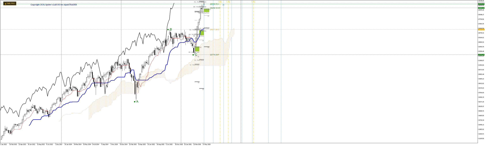
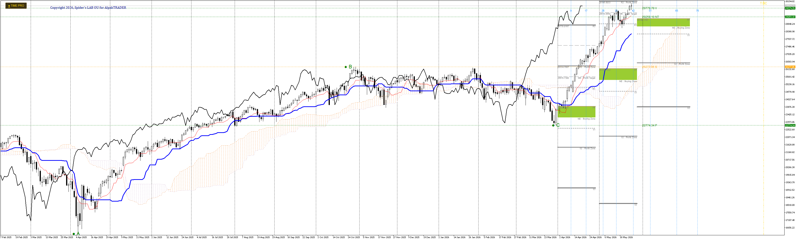

# FutureTargets Lite

> Free MetaTrader 5 indicator for **Hosoda price projections**.
> Drag three anchors on any A-B-C swing → four projected targets, live.

---

*NASDAQ 100 Weekly — anchors `A` `B` `C` (green), projected price targets `V` / `N` / `E` / `NT` (and Pro-only `S` / `P`), Kihon Suchi & Taito Suchi time cycles. Pro tier shown.*

---

## What it does

Place three anchors (`A`, `B`, `C`) on any swing — high, retrace, second leg — and the indicator computes four projection targets from Goichi Hosoda's full Ichimoku methodology. Targets recompute live as you drag.

### The math (Lite tier)

| Target | Formula | Interpretation |
|--------|---------|----------------|
| **V**  | `B + (B − C)` | Equal-distance reaction |
| **N**  | `C + (B − A)` | Wave-equality projection |
| **E**  | `B + (B − A)` | Trend continuation |
| **NT** | `C + (C − A)` | Late-stage extension |

Drop the indicator on a chart → three anchors appear → drag them to your swing points → targets render as horizontal lines with price labels.

Works on **any account** (demo or live). No whitelist, no nag.

---

## See it in action

**Daily timeframe** — same setup zoomed in:

---

## Lite vs Pro

Lite ships with the four fundamental Hosoda targets. Pro adds extended projections, automation, and time-theory overlays:

|  | Lite (this) | Pro |
|---|:---:|:---:|
| A-B-C anchors | ✓ | ✓ |
| V / N / E / NT price targets | ✓ | ✓ |
| Extended targets (2E / 2V / 3E / 3V / S / P) | — | ✓ |
| Magnetic snap to bar high/low on drop | — | ✓ |
| Kihon Suchi time cycles `{9, 17, 26, 33, 42, 51, 65, 76}` | — | ✓ |
| Taito Suchi wave-equality time projections (AB / AC / BC) | — | ✓ |
| On-chart `TIME` toggle button + `T` hotkey | — | ✓ |
| Account licensing | open | per-account whitelist |

**Pro unlock:** [alphatrader.pl/tools/future-targets](https://www.alphatrader.pl/tools/future-targets)

---

## Install

1. **MT5 → File → Open Data Folder** → navigate to `MQL5/Indicators/`
2. Drop **`FutureTargets.ex5`** into that folder
3. **Right-click Navigator → Refresh** (or restart MT5)
4. Drag **`FutureTargets`** from `Navigator → Indicators` onto a chart
5. Three anchors `A` `B` `C` appear — drag to your swing high / low / retrace

Plug and play. No source compilation required.

---

## Notes

- **Pro features stripped at compile-time.** The Lite binary doesn't contain Pro code paths — preprocessor `#define LITE_VERSION` removes them at build, not at runtime.
- Works on every chart period (M1 → MN).
- Anchor positions persist when you change timeframe/symbol on the same chart.

---

## License

Proprietary. Free for personal use. See [LICENSE](LICENSE).

© SPIDER'S LAB OÜ · [spiderslab.dev](https://spiderslab.dev)
